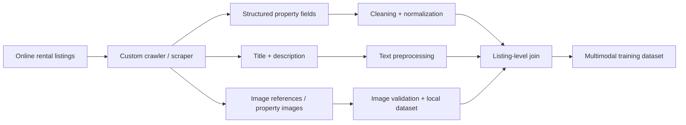
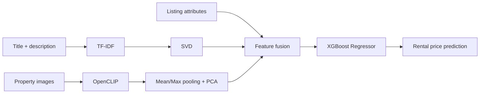

# RentAI — Multimodal Rental Price Prediction

RentAI is an end-to-end machine learning project for estimating residential rental prices in Ankara by combining **structured listing attributes, listing text, and property images** in a single prediction pipeline.

A major part of the project was the dataset itself: **I built the dataset from scratch rather than using a pre-existing Kaggle or benchmark dataset.** I developed the data-collection workflow to crawl/scrape online rental listings and collect the structured property attributes, listing titles and descriptions, image metadata, and property images required for multimodal modeling.

From raw data acquisition to cleaning, multimodal feature engineering, model training, evaluation, inference, API development, and frontend integration, the full pipeline was built as part of this project.

## Highlights

- **Original dataset collected from scratch** with a custom scraping/crawling workflow
- Collected **6,875 raw rental listings** and **100,522 property images**
- Captured and linked three modalities for each listing: **tabular attributes + text + images**
- Built data cleaning, normalization, validation, image processing, and multimodal joining pipelines
- TF-IDF + SVD representation for listing title and description
- OpenCLIP image embeddings with PCA dimensionality reduction
- XGBoost regression as the final estimator
- FastAPI inference API with multi-image upload support
- Next.js frontend for interactive predictions
- Experiment, dataset-quality, and error-analysis reports kept in the repository

## Dataset — Built From Scratch

No ready-made real-estate dataset was used as the foundation of RentAI. The data collection and dataset construction were part of the engineering work.

The collection pipeline was designed to gather rental listing information from online real-estate listings and turn it into a model-ready multimodal dataset.

### Data collection pipeline



The pipeline covered:

- crawling/scraping rental listing pages
- extracting structured fields such as location, room count, floor, size, building age, heating and other property attributes
- collecting the original listing title and description for NLP features
- collecting and storing property images and maintaining their listing-level relationships
- validating and cleaning scraped records
- normalizing inconsistent values into model-ready representations
- tracking listing IDs so tabular, textual, and visual data could be joined correctly
- creating dedicated tabular and multimodal training datasets

Dataset audit results in this repository report:

| Dataset asset | Count |
| --- | ---: |
| Raw listings | **6,875** |
| Unique listing IDs across dataset files | **6,920** |
| Property image files | **100,522** |
| Final Text + CLIP matched samples | **6,389** |

Large raw data and image assets are not committed to GitHub because of their size. Dataset structure and validation outputs are documented under `reports/`.

## Model Performance

Final held-out test results for the Text + CLIP multimodal model:

| Metric | Result |
| --- | ---: |
| MAE | **₺4,172.32** |
| RMSE | **₺6,179.27** |
| R² | **0.8477** |
| MAPE | **12.50%** |

Compared with the matched tabular baseline, the final multimodal model reduced MAE by approximately **₺528** and improved R² from **0.8013** to **0.8477**.

## Modeling Architecture



The final experiment used:

- up to **16 images per listing**
- **5,000** TF-IDF features
- **32-dimensional** text SVD representation
- **32-dimensional** image PCA representation
- **6,389** multimodal-ready matched listings in the final Text + CLIP experiment

## End-to-End Project Scope

RentAI was not limited to model training. The project covers the complete ML lifecycle:

1. **Data acquisition** — custom crawling/scraping and image collection
2. **Dataset engineering** — cleaning, normalization, validation and modality alignment
3. **Baseline modeling** — structured/tabular rental-price prediction
4. **Text modeling** — listing titles and descriptions with TF-IDF + SVD
5. **Vision modeling** — property images with CLIP/SigLIP experiments
6. **Multimodal fusion** — tabular + text + image representations
7. **Evaluation** — overall, district, price-range and error analysis
8. **Inference** — reusable single-listing prediction pipeline
9. **Backend** — FastAPI service for production-like inference
10. **Frontend** — Next.js interface for interactive predictions

## Tech Stack

**Data & Machine Learning**
- Python
- pandas / NumPy
- scikit-learn
- XGBoost
- OpenCLIP / PyTorch
- Transformers
- PyArrow

**Application**
- FastAPI
- Next.js 15
- React 19
- TypeScript
- Tailwind CSS
- React Query

## Repository Structure

```text
backend/       FastAPI application and inference service
frontend/      Next.js prediction interface
src/           preprocessing, training, embedding and inference code
reports/       dataset audits, experiment results and model analysis
examples/      example listing payloads
data/          project data helpers / local data structure
```

## Local Setup

### 1. Python environment

```bash
git clone https://github.com/beratcalik/rentai-multimodal-rent-prediction.git
cd rentai-multimodal-rent-prediction

python -m venv .venv
# Windows
.venv\Scripts\activate
# macOS / Linux
# source .venv/bin/activate

pip install -r requirements.txt
```

### 2. Model artifact

The inference pipeline expects the trained model bundle at:

```text
models/final_multimodal_text_clip_model.joblib
```

Large datasets, listing images, and trained model artifacts are intentionally not committed to the repository. The preprocessing, training, embedding, validation, and inference pipelines under `src/` and the reports under `reports/` document how the final system was produced.

### 3. Run the API

```bash
uvicorn backend.main:app --reload
```

The API is available at `http://127.0.0.1:8000`.

### 4. Run the frontend

```bash
cd frontend
npm install
cp .env.example .env.local
npm run dev
```

On Windows PowerShell:

```powershell
Copy-Item .env.example .env.local
```

The frontend runs at `http://localhost:3000` by default.

## Example Input

A complete example listing payload is available at:

```text
examples/sample_listing_input.json
```

It contains the same three types of information used throughout the project: structured property attributes, listing text, and property images.

## Experiment Reports

The `reports/` directory includes reproducible summaries for:

- dataset inspection and quality validation
- tabular baselines
- image embedding experiments
- CLIP and SigLIP experiments
- fusion and dimensionality-reduction ablations
- final Text + CLIP evaluation
- district and price-range analysis
- error analysis
- FastAPI integration

The main final evaluation is documented in `reports/final_multimodal_text_clip_results.md`, while dataset construction and audit statistics are documented in `reports/dataset_summary.md`.

## Purpose

RentAI demonstrates the complete construction of a real-world multimodal ML system: **collecting the raw data, building the dataset, engineering three modalities, training and evaluating the models, and delivering the final model through an API and web interface.**