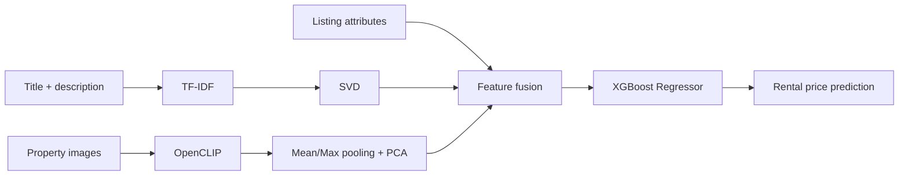

# RentAI — Multimodal Rental Price Prediction

RentAI is an end-to-end machine learning project for estimating residential rental prices in Ankara by combining **structured listing attributes, listing text, and property images** in a single prediction pipeline.

The project covers data preparation, multimodal feature extraction, model experimentation, evaluation, single-listing inference, a FastAPI backend, and a Next.js interface.

## Highlights

- Multimodal learning from **tabular + text + image** inputs
- TF-IDF + SVD representation for listing title and description
- OpenCLIP image embeddings with PCA dimensionality reduction
- XGBoost regression as the final estimator
- FastAPI inference API with multi-image upload support
- Next.js frontend for interactive predictions
- Experiment and error-analysis reports kept in the repository

## Model Performance

Final held-out test results for the Text + CLIP multimodal model:

| Metric | Result |
| --- | ---: |
| MAE | **₺4,172.32** |
| RMSE | **₺6,179.27** |
| R² | **0.8477** |
| MAPE | **12.50%** |

Compared with the matched tabular baseline, the final multimodal model reduced MAE by approximately **₺528** and improved R² from **0.8013** to **0.8477**.

## Architecture



The final experiment used:

- up to **16 images per listing**
- **5,000** TF-IDF features
- **32-dimensional** text SVD representation
- **32-dimensional** image PCA representation
- **6,389** multimodal-ready matched listings in the final Text + CLIP experiment

## Tech Stack

**Machine Learning**
- Python
- pandas / NumPy
- scikit-learn
- XGBoost
- OpenCLIP / PyTorch
- Transformers

**Application**
- FastAPI
- Next.js 15
- React 19
- TypeScript
- Tailwind CSS
- React Query

## Repository Structure

```text
backend/       FastAPI application and inference service
frontend/      Next.js prediction interface
src/           preprocessing, training, embedding and inference code
reports/       experiment results, dataset analysis and model reports
examples/      example listing payloads
data/          project data helpers / local data structure
```

## Local Setup

### 1. Python environment

```bash
git clone https://github.com/beratcalik/rentai-multimodal-rent-prediction.git
cd rentai-multimodal-rent-prediction

python -m venv .venv
# Windows
.venv\Scripts\activate
# macOS / Linux
# source .venv/bin/activate

pip install -r requirements.txt
```

### 2. Model artifact

The inference pipeline expects the trained model bundle at:

```text
models/final_multimodal_text_clip_model.joblib
```

Large datasets, listing images, and trained model artifacts are not committed to the repository. The training and feature-extraction pipelines under `src/` document how the model was produced.

### 3. Run the API

```bash
uvicorn backend.main:app --reload
```

The API is available at `http://127.0.0.1:8000`.

### 4. Run the frontend

```bash
cd frontend
npm install
cp .env.example .env.local
npm run dev
```

On Windows PowerShell, copy the environment file with:

```powershell
Copy-Item .env.example .env.local
```

The frontend runs at `http://localhost:3000` by default.

## Example Input

A complete example listing payload is available at:

```text
examples/sample_listing_input.json
```

It contains structured property fields, listing text, and local image paths used by the multimodal inference pipeline.

## Experiment Reports

The `reports/` directory includes reproducible summaries for:

- dataset quality and preparation
- tabular baselines
- CLIP embedding experiments
- fusion and dimensionality-reduction ablations
- final Text + CLIP evaluation
- error analysis
- FastAPI integration

The main final evaluation is documented in `reports/final_multimodal_text_clip_results.md`.

## Purpose

This project was built to explore how visual and textual information can improve real-estate valuation beyond traditional structured features, while also packaging the resulting model behind a usable web application.